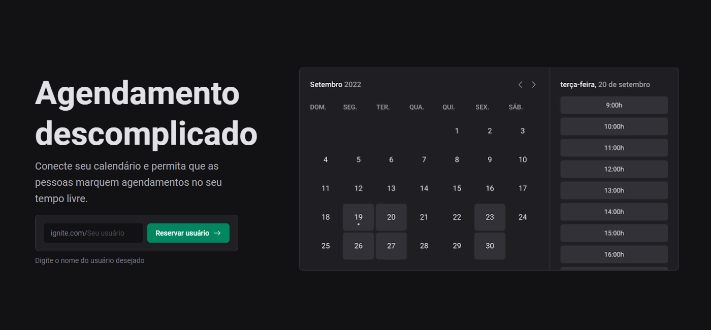
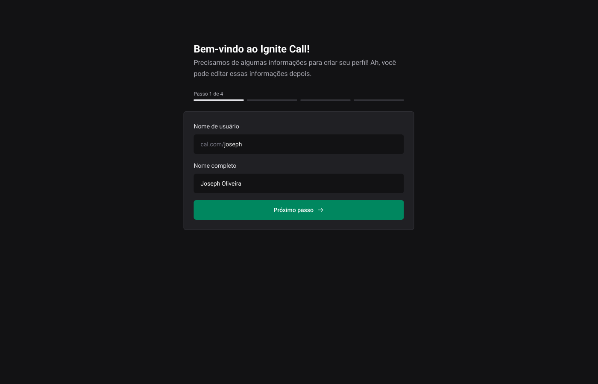
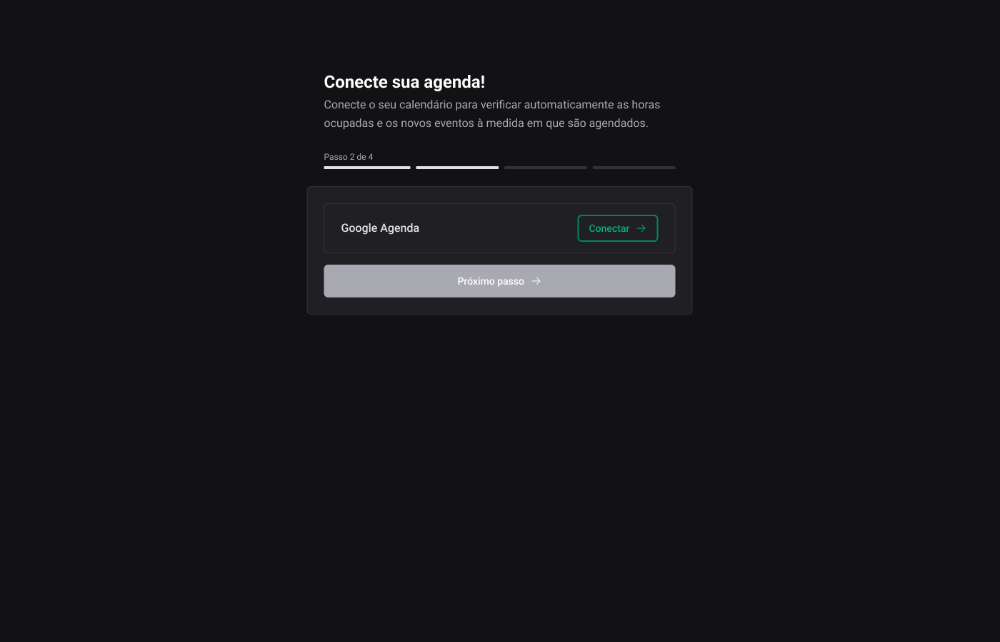
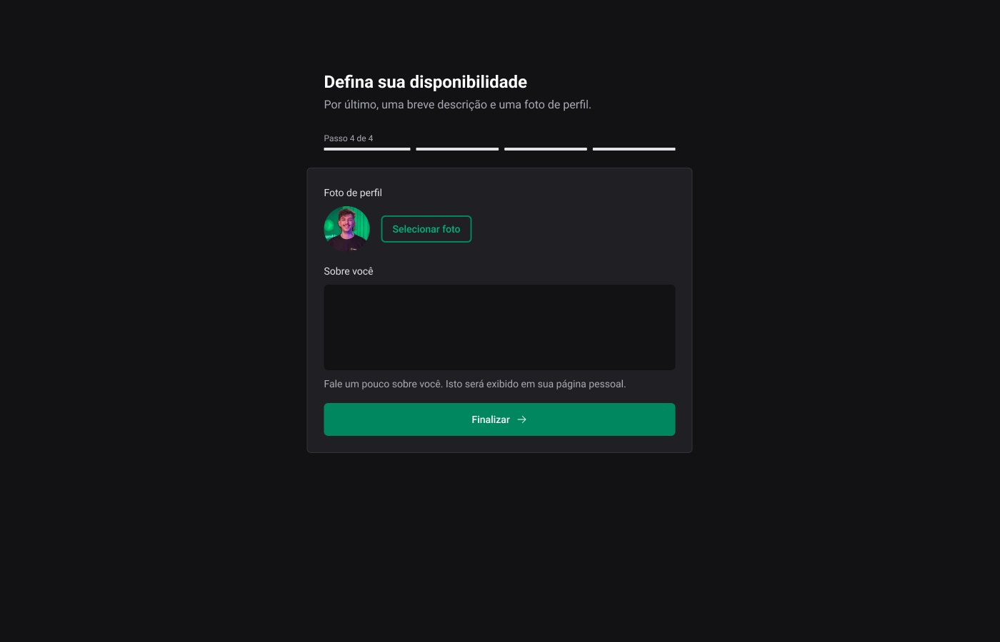
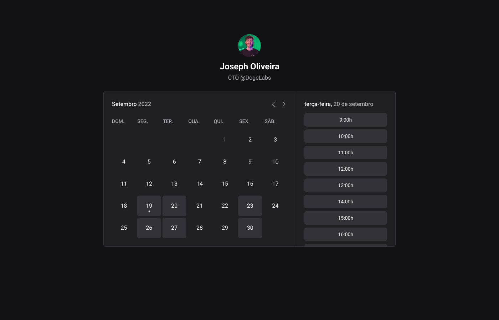
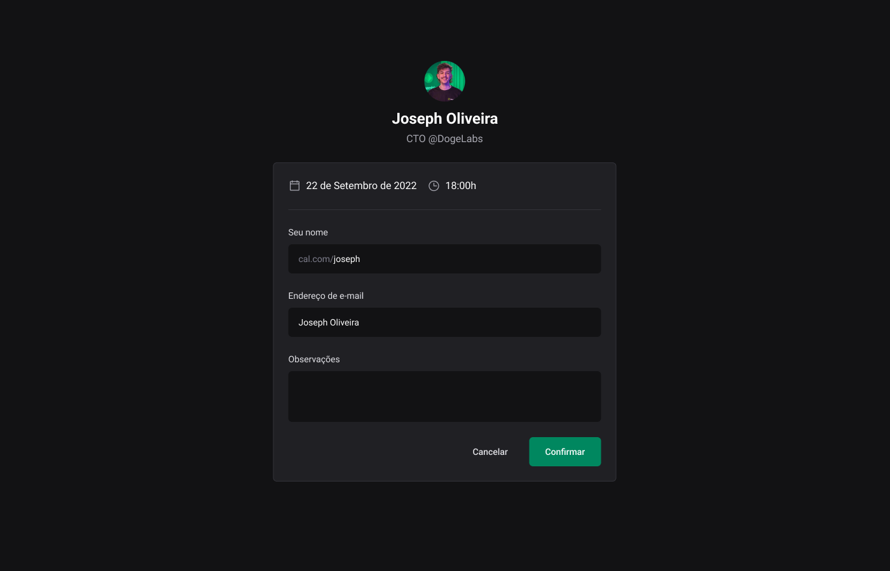
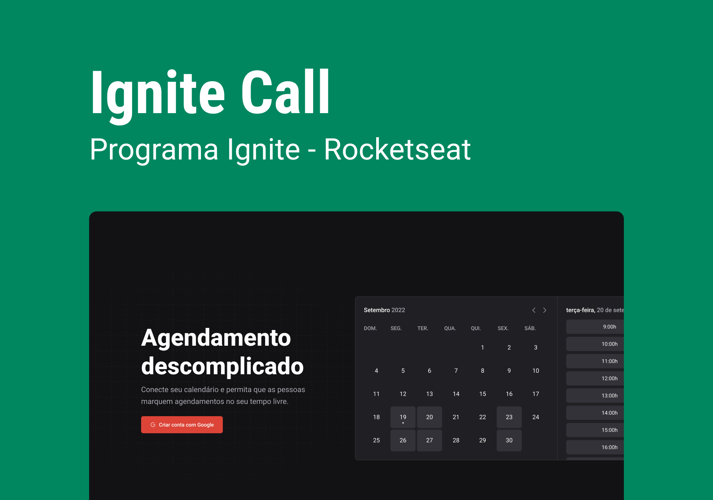

# Ignite Call

## Origin

- Project created together with @Rocketseat 🚀

- Ignite trail | ReactJS ⚛️

## Home page
- 🗓️ Hassle-free scheduling


## Create user
- 👤 Enter some information to create a user


## Connect Google Calendar
- 📅 Connect to Google Calendar through an account


## Availability
- 🕓 Inform your availability of days and times


## More informations
- ℹ️ Enter more informations to complete registration


  ## User scheduling
- 🗓️ Other users will be able to select one of your availabilities


  ## Scheduling
- 🗓️ Other users will be able to make appointments. These appointments will go to your Google Calendar


## Technologies used
 - HTML
 - CSS
 - Typescript
 - React.js
 - Next.js

## Libraries used
 - axios
 - dayjs
 - eslint
 - eslint-config-next
 - googleapis
 - next
 - next-auth
 - next-seo
 - nookies
 - phosphor-react
 - prisma
 - react
 - react-dom
 - react-hook-form
 - zod

## How to run this project
```bash
# Clone this repository
$ git clone https://github.com/Gian-Milani/Ignite-call.git

# Access the folder
$ cd Ignite-call

# Install dependencies
$ npm install 

# Run the aplication
$ npm run dev
```

## Resume
This project was based on a challenge from @Rocketseat's Ignite Journey, ReactJS trail. Using Design System, a complete application was created until deployment. Addressing authenticated routes in Next.js, integration with Google Calendar and validations for hassle-free scheduling.

#

